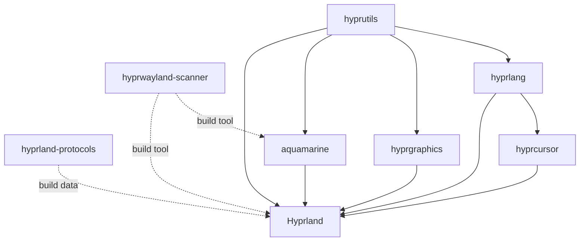
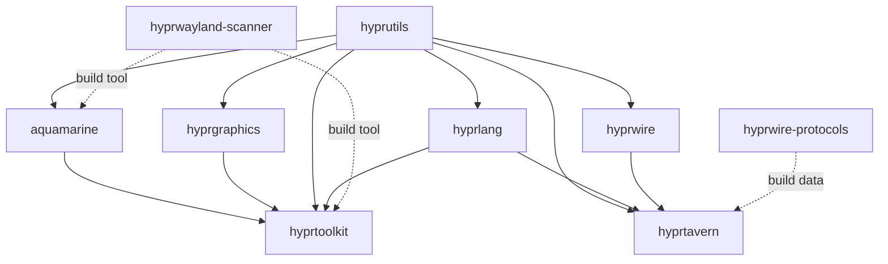

# Dependency graph and build order

This document describes dependencies encoded in upstream build metadata. It
does not promote optional applications to hard dependencies of the compositor.

## Edge types

- **Link**: compiled object or shared-library dependency.
- **Build tool**: executable used to generate source code.
- **Build data**: protocol or other data read while generating source code.
- **Runtime integration**: executable or service used after installation but
  not linked into the consumer.
- **Exact plugin ABI**: runtime-loaded C++ plugin that must match a specific
  Hyprland build.

## Core graph

### Why each core dependency exists

| Consumer | Dependency | Type | Reason encoded upstream |
|---|---|---|---|
| hyprlang | hyprutils >= 0.7.1 | Link | Shared utility types and helpers used by the parser |
| hyprgraphics | hyprutils | Link | Common utility and resource abstractions |
| hyprcursor | hyprlang >= 0.4.2 | Link | Cursor themes and metadata use Hypr configuration parsing |
| aquamarine | hyprutils >= 0.8.0 | Link | Shared data structures, signals, memory, and system helpers |
| aquamarine | hyprwayland-scanner >= 0.4.0 | Build tool | Generates C++ bindings for Wayland protocol XML |
| Hyprland | aquamarine >= 0.9.3 | Link | Output, DRM/KMS, renderer, allocator, and input backend |
| Hyprland | hyprutils >= 0.13.1 | Link | Common utility implementation used throughout the compositor |
| Hyprland | hyprlang >= 0.6.7 | Link | Parses `hyprland.conf` and related configuration |
| Hyprland | hyprgraphics >= 0.5.1 | Link | Image and graphics resource handling |
| Hyprland | hyprcursor >= 0.1.7 | Link | Hypr cursor-theme support |
| Hyprland | hyprwayland-scanner >= 0.3.10 | Build tool | Generates protocol C++ sources before compilation |
| Hyprland | hyprland-protocols >= 0.6.4 | Build data | Supplies Hyprland-specific protocol XML |

`hyprwayland-scanner` and `hyprland-protocols` are not runtime requirements of
the compiled Hyprland binary. Their output is compiled into Hyprland. They
belong in RPM `BuildRequires`, not explicit runtime `Requires`.

Hyprland 0.55.4 consumes seven of the eight protocol XML files shipped in
hyprland-protocols 0.7.0. `hyprland-input-capture-v1.xml` is present in the
protocol package but is not wired into the 0.55.4 compositor build.

## Extended library graph

| Consumer | Dependency | Type | Reason |
|---|---|---|---|
| hyprwire | hyprutils >= 0.9.0 | Link | Common IPC-side utility code |
| hyprtoolkit | aquamarine >= 0.10.0 | Public link | Wayland, renderer, buffer, and backend integration |
| hyprtoolkit | hyprgraphics >= 0.3.0 | Public link | Image and resource rendering |
| hyprtoolkit | hyprutils >= 0.11.0 | Public link | Common utility API exposed through toolkit headers |
| hyprtoolkit | hyprlang >= 0.6.0 | Private link | Toolkit configuration and theme parsing |
| hyprtoolkit | hyprwayland-scanner >= 0.4.0 | Build tool | Generates its Wayland protocol bindings |
| hyprtavern | hyprutils >= 0.10.4 | Link | Common utilities |
| hyprtavern | hyprwire >= 0.2.1 | Link | IPC transport and generated wire protocol support |
| hyprtavern | hyprlang | Link | Configuration parsing |
| hyprtavern | hyprwire-protocols | Build data | Protocol XML located through a required pkg-config variable |

`hyprwire-protocols` currently provides no build system, install rule,
`VERSION`, tag, or pkg-config template. A downstream package would have to
define all of those installation details. That is why `hyprtavern` is outside
the initial stable package set.

## Application graph

```mermaid
graph TD
    HU[hyprutils]
    HL[hyprlang]
    HG[hyprgraphics]
    HC[hyprcursor]
    AQ[aquamarine]
    HWS[hyprwayland-scanner]
    HLP[hyprland-protocols]
    HW[hyprwire]
    HT[hyprtoolkit]
    HY[Hyprland]

    HU --> LOCK[hyprlock]
    HL --> LOCK
    HG --> LOCK
    HWS -. build .-> LOCK

    HU --> IDLE[hypridle]
    HL --> IDLE
    HLP -. build data .-> IDLE
    HWS -. build .-> IDLE

    HU --> PICK[hyprpicker]
    HWS -. build .-> PICK

    HU --> SUN[hyprsunset]
    HL --> SUN
    HLP -. build data .-> SUN
    HWS -. build .-> SUN

    HU --> XDP[xdg-desktop-portal-hyprland]
    HL --> XDP
    HLP -. build data .-> XDP
    HWS -. build .-> XDP

    HT --> PAPER[hyprpaper]
    HW --> PAPER
    HU --> PAPER
    HL --> PAPER
    HWS -. build .-> PAPER

    HT --> LAUNCH[hyprlauncher]
    HW --> LAUNCH
    HU --> LAUNCH
    HL --> LAUNCH

    HT --> POLKIT[hyprpolkitagent]
    HG --> POLKIT
    HU --> POLKIT
    HL --> POLKIT

    HT --> PWC[hyprpwcenter]
    HU --> PWC

    HT --> SHUT[hyprshutdown]
    HU --> SHUT

    HT --> INFO[hyprsysteminfo]
    HU --> INFO

    HT --> GUI[hyprland-guiutils]
    HU --> GUI
    HL --> GUI

    HY == exact plugin ABI ==> PLUG[hyprland-plugins]
```

### Application dependency rationale

| Application | Hypr dependencies | Why |
|---|---|---|
| hyprpaper | hyprtoolkit, hyprwire, hyprlang, hyprutils, scanner | Native UI/rendering path, IPC, configuration, and generated Wayland bindings |
| hyprlock | hyprgraphics, hyprlang, hyprutils, scanner | Image rendering, configuration, shared utilities, and generated lock protocols |
| hypridle | hyprlang, hyprutils, protocols, scanner | Configuration, shared utilities, and idle/lock protocol generation |
| hyprpicker | hyprutils, scanner | Shared utilities and generated capture protocol bindings |
| hyprsunset | hyprlang, hyprutils, protocols, scanner | Configuration and CTM protocol generation |
| xdg-desktop-portal-hyprland | hyprlang, hyprutils, protocols, scanner | Portal configuration, shared utilities, and screenshot/screencast protocol generation |
| hyprlauncher | hyprtoolkit, hyprwire, hyprlang, hyprutils | UI, launcher IPC protocol, configuration, and utilities |
| hyprpolkitagent | hyprtoolkit, hyprgraphics, hyprlang, hyprutils | Native authentication UI and resource/config support |
| hyprpwcenter | hyprtoolkit, hyprutils | Native UI and shared utilities |
| hyprshutdown | hyprtoolkit, hyprutils | Native UI and shared utilities |
| hyprsysteminfo | hyprtoolkit, hyprutils | Native UI and system helpers |
| hyprland-guiutils | hyprtoolkit, hyprlang, hyprutils | Native UI, configuration, and utility support |
| hyprqt6engine | hyprlang, hyprutils | Qt theme configuration and shared helpers |
| hyprland-qt-support | hyprlang | QML style configuration |
| hyprland-plugins | exact Hyprland headers and commit | Plugins include Hyprland internal C++ headers and are loaded in-process |

## External dependency groups

The exact Fedora package-name mapping is maintained in the Fedora packaging
design. Upstream manifests establish these functional groups:

- Wayland: `wayland-client`, `wayland-server`, `wayland-egl`,
  `wayland-protocols`, XKB, Xcursor, and XWayland/XCB components.
- Rendering and graphics: DRM, GBM, EGL, GLES, pixman, cairo, pango,
  librsvg, JPEG, PNG, WebP, JPEG XL, HEIF, lcms2, and libdisplay-info.
- Input and seats: libinput, libseat, libudev, and hwdata.
- Desktop IPC: PipeWire, SPA, D-Bus, sdbus-c++, PAM, polkit, systemd, UUID,
  and libffi.
- Parsing and utilities: RE2, muparser, Lua 5.5, tomlplusplus, pugixml,
  iniparser, glaze, ICU, fontconfig, libqalculate, libzip, libmagic, and
  glslang.
- Optional XWayland support: `xcb`, render, xfixes, icccm, composite, res,
  errors, and related xcb-util libraries.

## Topological build order

The order below is the package build order, not the user-visible installation
order. Items on the same line can build in parallel once the prior tier is
available in the temporary build repository.

1. `hyprwayland-scanner`, `hyprutils`, `hyprland-protocols`
2. `hyprlang`, `hyprgraphics`, `hyprwire`
3. `hyprcursor`, `aquamarine`, `hyprqt6engine`,
   `hyprland-qt-support`
4. `Hyprland`, `hyprtoolkit`
5. `hyprlock`, `hypridle`, `hyprpicker`, `hyprsunset`,
   `xdg-desktop-portal-hyprland`
6. `hyprpaper`, `hyprlauncher`, `hyprpolkitagent`, `hyprpwcenter`,
   `hyprshutdown`, `hyprsysteminfo`, `hyprland-guiutils`
7. `hyprland-plugins`, after selecting the exact plugin commit compatible
   with the built Hyprland commit

Experimental `hyprwire-protocols` and `hyprtavern` are excluded from this
stable order until they have an upstream release and install contract.

## Stable compatibility set

The first stable Fedora 44 build should use one reviewed lock set:

| Component | Selected upstream source | Compatibility basis |
|---|---:|---|
| Hyprland | 0.55.4 | Latest stable patch release |
| aquamarine | 0.12.1 | Exceeds Hyprland minimum 0.9.3 |
| hyprutils | 0.13.1 | Matches Hyprland minimum exactly |
| hyprlang | 0.6.8 | Exceeds Hyprland minimum 0.6.7 |
| hyprgraphics | 0.5.1 | Matches Hyprland minimum exactly |
| hyprcursor | 0.1.13 | Exceeds Hyprland minimum 0.1.7 |
| hyprwayland-scanner | 0.4.6 | Exceeds all stable scanner minimums |
| hyprland-protocols | 0.7.0 | Exceeds Hyprland minimum 0.6.4 |
| hyprwire | 0.3.1 | Latest stable release |
| hyprtoolkit | 0.5.4 | Latest stable release; compatible with aquamarine 0.12.1 |

This is a repository-wide release set, not permission to update each package
independently. Any SONAME change or raised minimum triggers a reverse
dependency rebuild and a new atomic repository snapshot.

## ABI findings

| Library | Stable version | SOVERSION |
|---|---:|---:|
| hyprutils | 0.13.1 | 12 |
| hyprlang | 0.6.8 | 2 |
| hyprgraphics | 0.5.1 | 4 |
| hyprcursor | 0.1.13 | 0 |
| aquamarine | 0.12.1 | 11 |
| hyprwire | 0.3.1 | 3 |
| hyprtoolkit | 0.5.4 | 5 |

Semantic versions and SONAMEs are intentionally independent upstream.
Compatibility automation must inspect the actual installed SONAME on every
update.

Hyprland itself has a stricter problem: its plugin interface consists largely
of installed internal headers, and plugins are mapped to exact compositor
commits in `hyprpm.toml`. A normal `Requires: hyprland >= X` is insufficient.
Plugin RPMs must require the exact Hyprland EVR against which they were built,
and all plugin packages must be rebuilt with every compositor build.
